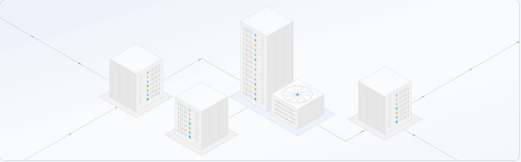
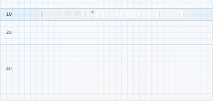

# skill-svg-light-line-illustration

Agent skill for the **light-line isometric SVG illustration style** — thin token-based strokes, 2.5D projection, modular primitives, depth-sorted vector scenes.

## How it works

This skill does not jump straight to code. The intended workflow is **requirement alignment with the agent** — iterate in the browser until you approve a mockup, then implement modular SVG parts in the host app.

That alignment loop depends on [Superpowers](https://github.com/obra/superpowers) (`brainstorming` skill + visual companion). Install Superpowers first, then this skill.

| Step | What happens |
|------|----------------|
| 1 | Superpowers `brainstorming` explores intent; visual companion shows mockups at the real card size |
| 2 | You critique; agent revises (`v1` → `v2` → …) until the layout reads right |
| 3 | You approve (or tweak the mockup yourself); agent implements `*-parts` + demo component |
| 4 | Screenshot on dev server confirms it matches what you signed off |

Detail: [`svg-light-line-illustration/workflow.md`](./svg-light-line-illustration/workflow.md)

## Prerequisites

**[Superpowers](https://github.com/obra/superpowers)** — agentic skills framework with brainstorming and visual companion.

Cursor:

```
/add-plugin superpowers
```

Other clients: see [Superpowers installation](https://github.com/obra/superpowers#installation).

## Install this skill

Copy `svg-light-line-illustration/` into your agent skills path. The skill is **self-contained** — `reference.md` embeds code excerpts so the agent does not need this repo's `examples/` folder.

| Client | Path |
|--------|------|
| Cursor | `.cursor/skills/svg-light-line-illustration/` or `.agents/skills/svg-light-line-illustration/` |
| Codex | `.codex/skills/svg-light-line-illustration/` |
| Claude Code | `.claude/skills/svg-light-line-illustration/` |

Invoke in Cursor: `/svg-light-line-illustration`

```
svg-light-line-illustration/
├── SKILL.md        # style rules + workflow summary
├── workflow.md     # requirement-alignment loop (Superpowers)
└── reference.md    # composition rules + code excerpts
```

## Preview

```bash
npx --yes serve .
```

Open [index.html](./index.html).

## Examples

Reference illustrations in this style (not the only valid subjects):

### Spatial isometric scene (640×200)



[Open interactive demo](./examples/overview-datacenter.html)

### Stacked front-panel carousel (421×200)



[Open interactive demo](./examples/dedicated-server-rack.html)

> For live interaction, run `npx serve .` and open [index.html](./index.html).

## License

MIT
