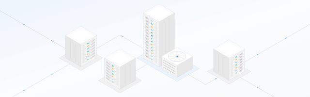
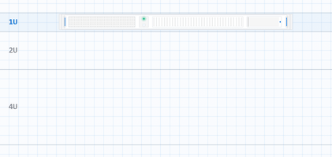

# modular-svg-illustration

Modular SVG illustration — assemble primitives into scenes. See [SKILL.md](./SKILL.md).

## Preview

### Spatial isometric scene (640×200)



### Stacked front-panel carousel (421×200)



## Re-record GIFs

Interactive HTML under `examples/` is the source. From this directory:

```bash
npm i playwright
npx playwright install chromium
node scripts/record-preview-gifs.mjs
```
