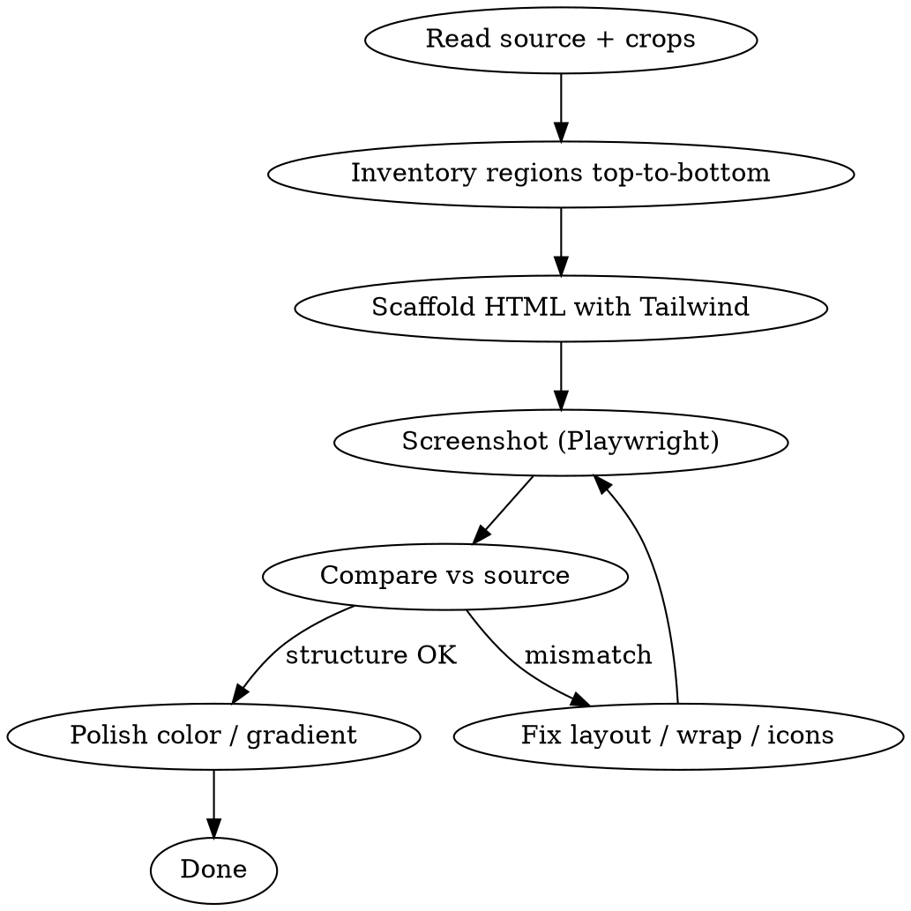

# Reference Image to HTML

Turn a fixed-layout reference image into browser-renderable HTML and export a high-resolution PNG via Playwright.

## Overview

**Core principle:** Structure and typography come from the image; verification is screenshot-driven comparison against the source, not eyeballing markup.

**Default stack:** Tailwind CSS (Play CDN for single-file deliverables, or project build if one exists) — do not start with a large custom `<style>` block and migrate later.

**REQUIRED:** Run a compare loop every iteration — capture HTML with Playwright, diff against the source image, fix layout / wrapping / icons before tweaking colors.

## When to Use

- User attaches a reference image and asks for HTML
- User says layout, gradients, or fonts do not match the image
- User wants a 2× PNG export or Playwright screenshot workflow
- User points at DOM paths or line ranges for pixel-level fixes

**When NOT to use:** Responsive marketing sites without a fixed raster target, or layouts where the reference is wireframe-only with no visual ground truth.

## Inputs

| Input | Purpose |
|-------|---------|
| Source image (full + crops if provided) | Ground truth for every compare pass |
| Extracted raster assets | Backgrounds, logos, product art, QR codes — filenames follow project convention |
| Copy | Transcribe text from the image; confirm numbers and legal copy |
| Canvas width | Measure from source aspect ratio or user spec; drives `max-w-*` and Playwright viewport |
| Typography | Match image or `lang` (e.g. CJK → Noto Sans SC / JP / KR; Latin → project font) |
| Icon policy | **Match the source:** emoji where the image uses emoji; Lucide (or similar) for line UI icons — do not swap types unless user asks |

## Stack

```
index.html          # single file, browser-openable (typical)
screenshot.mjs      # Playwright 2× export — see @screenshot.mjs
package.json        # playwright dependency when exporting
```

- **CSS:** Tailwind — Play CDN for standalone deliverables, or existing Tailwind in repo
- **Icons:** Lucide UMD + `lucide.createIcons()` after DOM ready; wait for SVG before screenshot
- **Fonts:** Google Fonts or local files matching the reference
- **Config:** Extend `tailwind.config` only with tokens **this image needs** (brand colors, font family). Prefer standard spacing/sizing utilities; add arbitrary values only when standard scale cannot approximate the reference and user cares about pixel fidelity

## Workflow



### 1. Decompose the image

Read the full reference and list regions **top to bottom** using names that fit *this* image — do not force a fixed template.

Examples of region types (use only what appears):

- Hero / header (photo, logo, headline, feature row)
- CTA or offer strip
- Card grids (any column count)
- Pricing or product blocks
- Feature / trust section
- Footer (legal, contact, QR)

Note: continuous background vs inset cards, gradients, text wrap points, alignment per block.

### 2. Scaffold with Tailwind first

Build semantic HTML + utility classes. Match **layout skeleton** before fine colors.

```html
<body class="m-0 p-0 ...">
  <div class="relative w-4xl ...">  <!-- 896px canvas; no outer padding or preview chrome -->
    <!-- sections in source order -->
  </div>
  <script>lucide.createIcons();</script>
</body>
```

HTML is the export artifact: no `body` padding, no gray preview background, no drop shadow on the canvas root.

**Layout rules (abstract — always verify against source):**

| Concern | Rule |
|---------|------|
| Region order | Same top-to-bottom order as reference |
| Grid columns | `grid-cols-N` matches card count in each row |
| Text wrap | Constrain width (`max-w-*`, column width) so long lines break like the image |
| Icon alignment | Multi-line labels: icon vertically centered to text block |
| Section icons | Sibling headings should not reuse the same icon if the reference distinguishes them |
| Alignment | Left / center / right per block as shown — do not assume prices or titles are right-aligned |
| Background continuity | Single canvas vs separate panels — copy what the image shows |
| Hero photo | Overlay only as heavy as needed for text legibility; avoid washing out the whole photo |
| Footer links | If reference shows one line, use `whitespace-nowrap` or smaller type — do not break mid-phrase |

### 3. Tailwind usage

- **Default:** standard utilities (`px-8`, `text-xl`, `gap-4`, `rounded-xl`, `max-w-5xl`, …)
- **Gradients / clip text:** arbitrary values OK when reproducing a specific gradient from the image
- **Background images:** `before:bg-[url('...')]` or inline style when needed
- **Lucide sizing:** `[&_svg]:h-5` or `stroke-[1.25]` to match line weight in reference
- **Motion:** static by default; add animation only if the reference is animated or user requests it

### 4. Compare loop (mandatory)

Each round:

1. Capture via `node screenshot.mjs` or `npx playwright screenshot`
2. View capture beside source image
3. List **concrete** diffs: wrong wrap, wrong icon, wrong card structure — not vague padding tweaks
4. Prefer fixing one class of issue per round

**Stop when:** user approves, or remaining gaps are irreplaceable assets (e.g. decorative photo details, placeholder QR).

### 5. Playwright export

Copy or adapt `screenshot.mjs` into the project. Set at top:

- `canvasWidth` — matches canvas root (`w-4xl` = 896px, or read computed width)
- `htmlFile` — entry HTML
- `outputFile` — PNG path (2× DPR via `deviceScaleFactor: 2`)

Run: `npm install playwright && npx playwright install chromium && node screenshot.mjs`

The script screenshots `body > div` directly — no style injection. HTML must already be edge-to-edge (no `body` padding).

## Scope discipline

When user references a DOM path or selection:

1. Identify the **exact** element (outer wrapper vs inner cards vs buttons)
2. If ambiguous, ask once — do not delete sibling content
3. Smallest diff only; no drive-by refactors

If the repo already uses Tailwind with a build pipeline, follow that setup instead of Play CDN.

When background subagents fail or abort: **edit files directly**; do not ask the user to wait again.

## Common mistakes

| Mistake | Fix |
|---------|-----|
| Fixed template that ignores source layout | Re-inventory regions from the image |
| Custom CSS first, Tailwind later | Start with Tailwind utilities |
| Heavy hero overlay | Lighten; fade only where text sits |
| Long feature text on one line | Column width + natural wrap |
| Cosmetic-only iterations | Re-read source; fix structure and icons first |
| Screenshot shows padding around canvas | Remove `body` padding / preview background from HTML; do not patch in Playwright |
| Declaring "matched" without capture | Always screenshot before claiming done |

## Red flags — stop and re-read source

- Three or more rounds tweaking spacing while layout is still wrong
- Assuming section backgrounds (white footer, boxed panels) without checking the image
- Deleting content the user did not name
- Adding motion without request
- Encoding one project's colors/width as universal constants in the skill or config

## Example: blue promo poster (Zouter Tokyo BGP)

_Optional reference patterns from a real project — not defaults for other images._

| Element | Pattern used |
|---------|----------------|
| Canvas | `w-4xl` (896px), continuous `from-blue-950 via-blue-800` body |
| Hero overlay | `after:bg-gradient-to-r from-blue-950 via-blue-950/70 to-transparent` over `background.png` |
| Hero features | 3 columns; route list wraps in narrow column |
| Discount strip | White / sky gradient pill; 🎉 emoji; promo code as blue→violet gradient pill, white text |
| Promo title | Lucide `gift` (section) vs `sparkles` (why section) |
| Cards | `bg-gradient-to-b from-white to-sky-50` |
| Plan layout | Title row → icon left + price block beside → specs → bullets |
| Footer contact | `whitespace-nowrap` for single-line TG links |
| Brand tokens in config | `ink`, `brand.orange`, `brand.gray`, `brand.green` |
| Export | `screenshot.mjs` with `canvasWidth: 896` → `poster-2x.png` at 2× DPR |

Use this table only when reproducing a similar blue SaaS promo layout.
